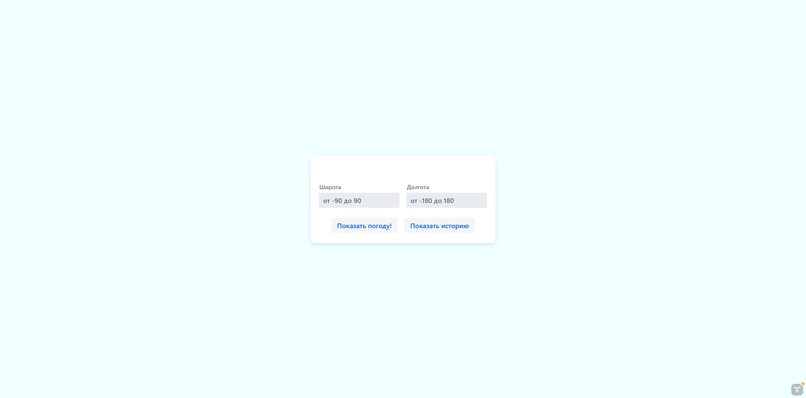
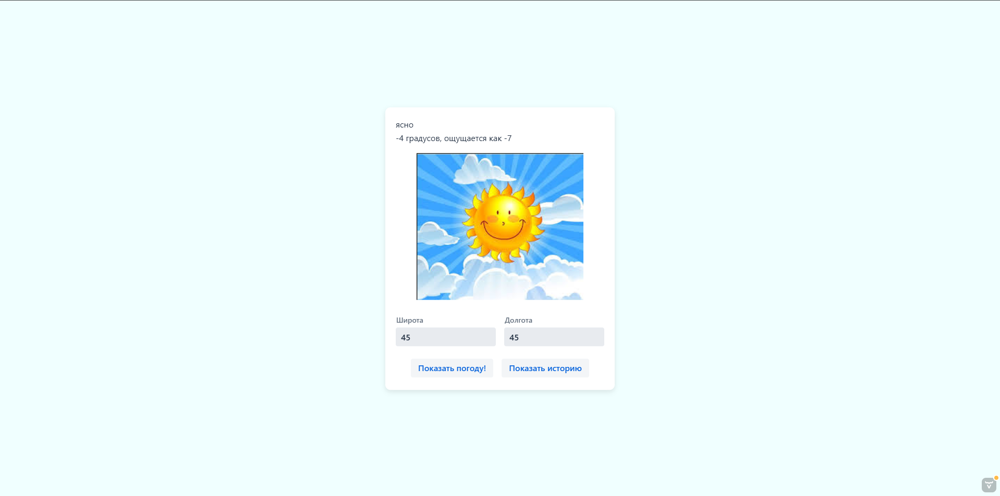
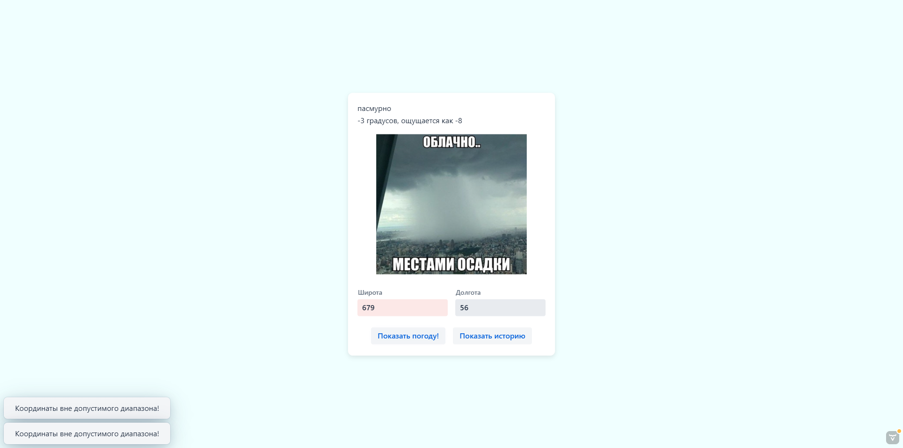
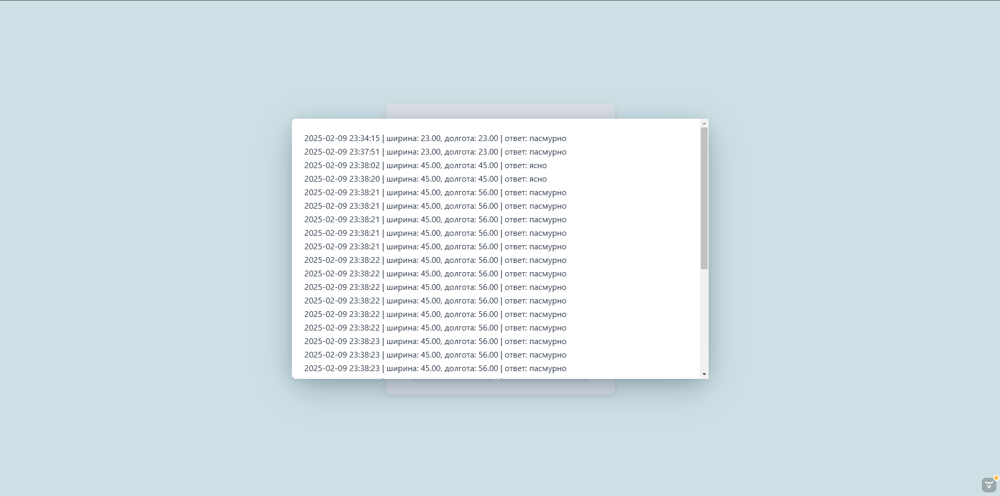

# Inerview

### Project Launch

Clone repository:
```bash
git clone https://github.com/Mopkovka13/trSoft_interview.git
```

Go to folder:
```bash
cd weather
```

Setup and launch containers
```bash
docker-compose up --build
```

Start application ;)


### Notes
- .env оставлен для удобства тестирования.

### Example of application working





